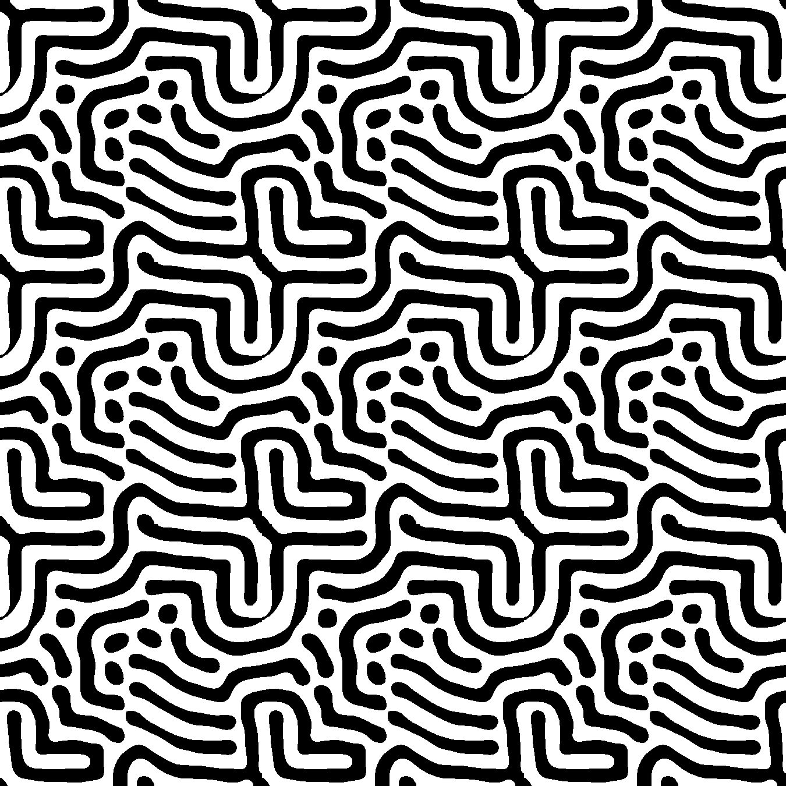
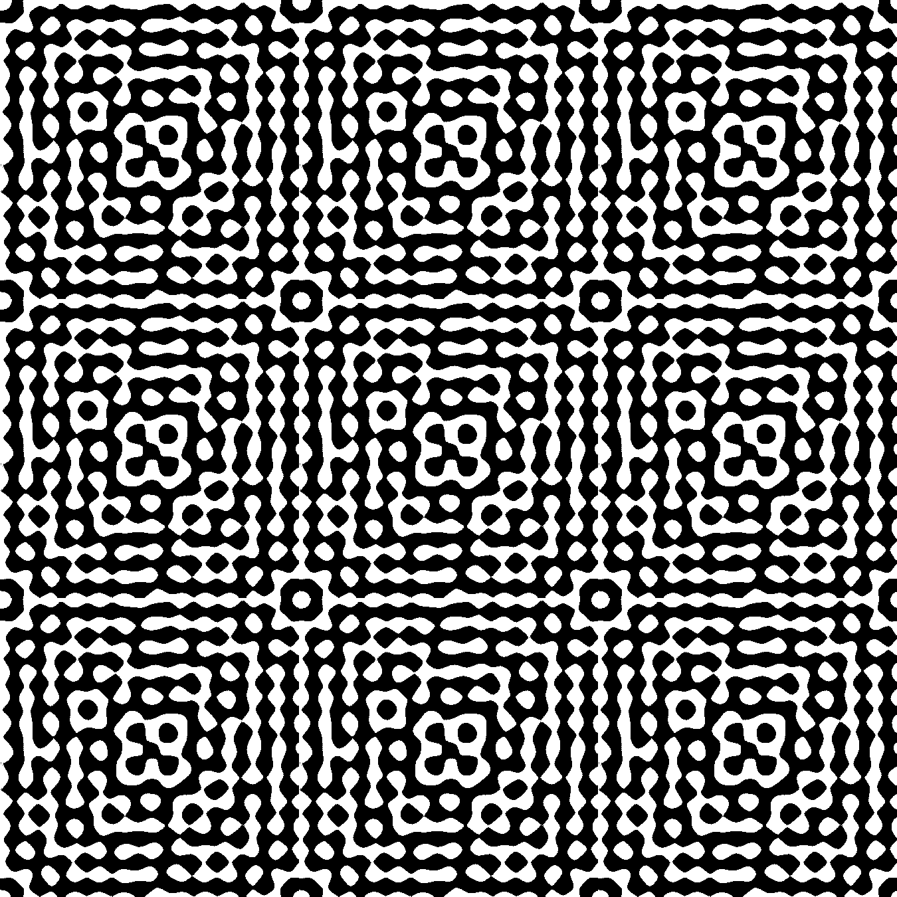
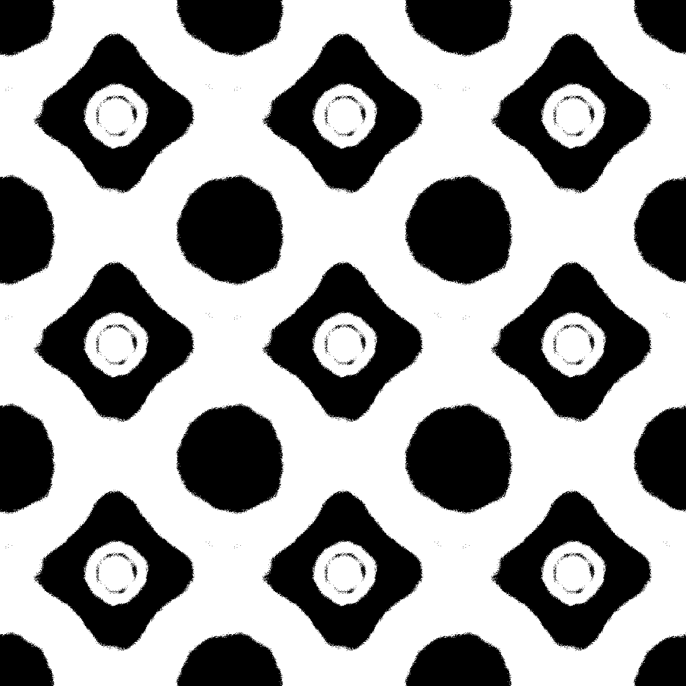
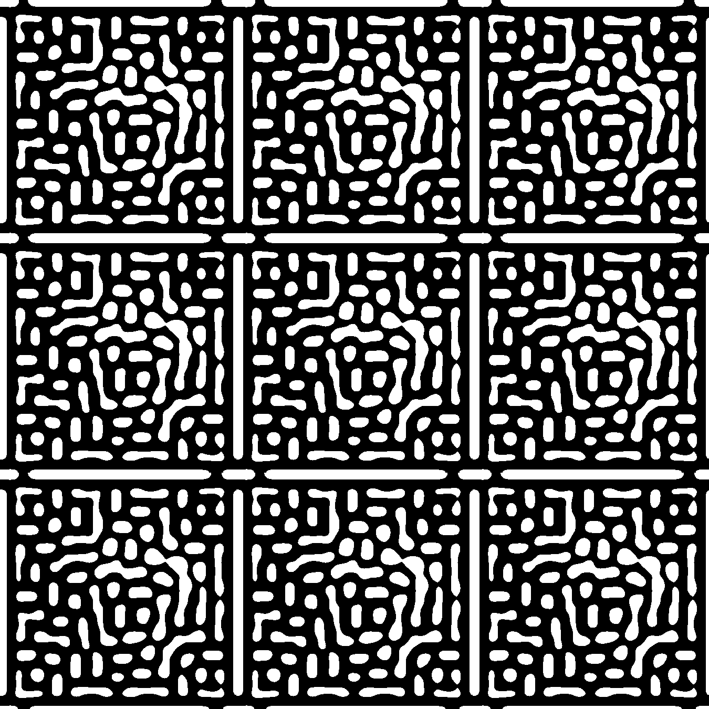
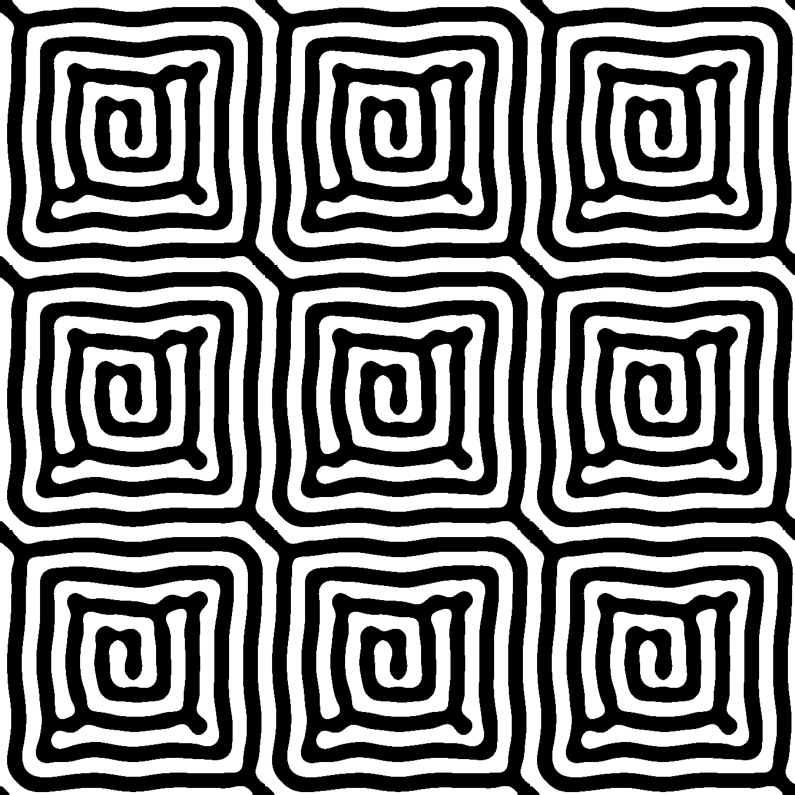
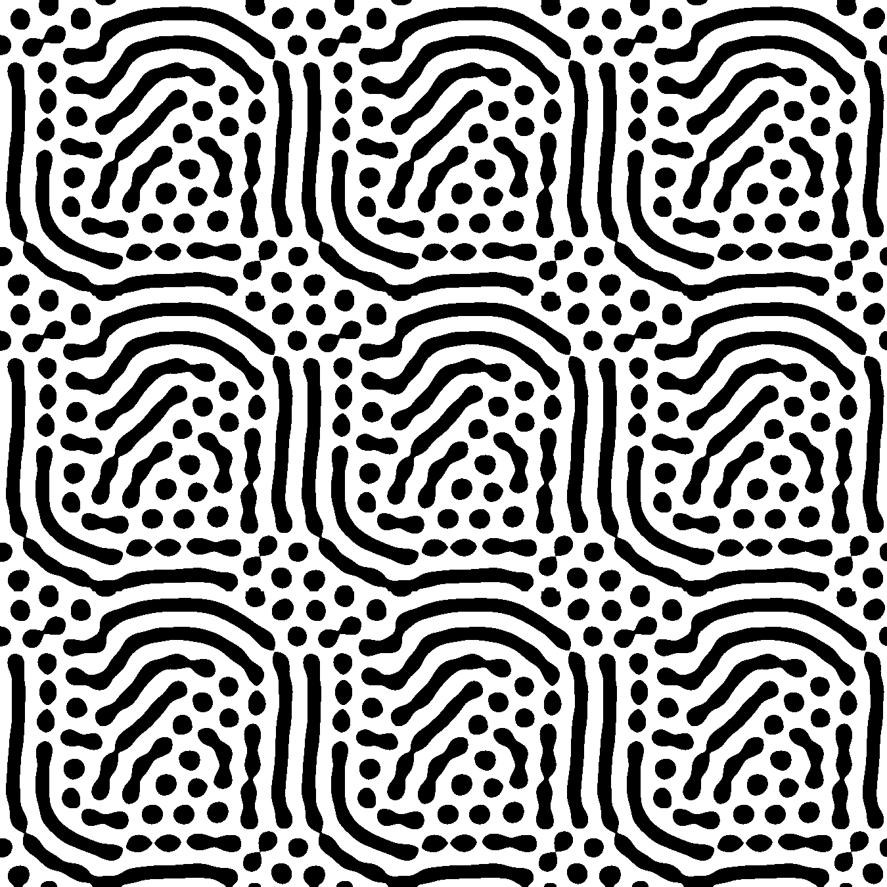

# Diffugen

Diffugen is a small Python creative-coding project that turns Gray–Scott reaction–diffusion simulations into seamless, black-and-white tiled wallpapers.

## Gallery

| Standard | Texture | Eggs |
| --- | --- | --- |
| [](examples/standard-seed-42.png) | [](examples/texture-seed-42.png) | [](examples/eggs-seed-42.png) |
| Capsules | Contours | Fingerprint |
| [](examples/capsules-seed-1002.png) | [](examples/contours-seed-1031.png) | [](examples/fingerprint-seed-1041.png) |

The [examples gallery](examples/README.md) contains nine curated images, exact preset commands, and the parameters used for five additional studies.

## Reaction–diffusion in brief

Reaction–diffusion systems describe substances that spread through space while reacting with one another. Even simple local rules can produce spots, stripes, rings, and maze-like structures as concentrations change over time.

Diffugen uses the Gray–Scott model. It tracks two virtual chemicals, `A` and `B`, on a square grid. Both chemicals diffuse into neighboring cells. At the same time, `A` is supplied, `B` is removed, and a reaction converts `A` into more `B`. The diffusion, feed, and kill rates determine which patterns develop.

This project uses that model as a source of generative artwork. It is not intended to be a research simulator, a general differential-equation framework, or a physically calibrated model.

## Installation

Diffugen requires Python 3.11 or newer. Create a virtual environment and install the project from the repository root:

```bash
python -m venv .venv
source .venv/bin/activate
python -m pip install -e .
```

To install the test dependency as well:

```bash
python -m pip install -e ".[dev]"
```

The package depends on NumPy, Pillow, and Matplotlib. The editable install also provides a `diffugen` console command; the examples below use `python -m diffugen` so it is clear which interpreter is running the package.

## Usage

List the built-in presets:

```bash
python -m diffugen --list-presets
```

Generate one wallpaper. Parent directories are created automatically:

```bash
python -m diffugen --preset standard --output output/standard.png
```

Supply a seed to make the randomized initial condition reproducible:

```bash
python -m diffugen \
  --preset texture \
  --size 64 \
  --steps 12000 \
  --scale 3 \
  --seed 42 \
  --output output/texture-seed-42.png
```

Generate all five presets into one directory:

```bash
python -m diffugen --all-presets --output-dir output/all-presets
```

Running without arguments prints the help text. To generate all presets using
the default `generated/` output directory, run:

```bash
python -m diffugen --all-presets
```

`generated/` is ignored by Git because it contains runtime artifacts.

The compatibility entry point `python main.py` and the installed `diffugen` command accept the same options.

## Presets

Presets choose the diffusion, feed, and kill rates used by the simulation.

| Preset | Character |
| --- | --- |
| `standard` | Broad, maze-like bands and loops. |
| `texture` | Dense, small-scale cells with a textile-like appearance. |
| `circles` | Large circular forms and open spaces. |
| `eggs` | Alternating circular and rounded-diamond structures. |
| `big_eggs` | Larger rings and dots, often on a darker field. |

Pattern descriptions are approximate. The visible result also depends on the grid size, step count, and seed.

## Parameters

| Option | Default | Meaning |
| --- | ---: | --- |
| `--preset NAME` | none | Generate one named preset. Use `--all-presets` to generate the complete set. |
| `--size N` | `64` | Width and height of the square simulation grid. Larger grids require more work per step. |
| `--steps N` | `20000` | Number of explicit simulation updates. Different durations can produce substantially different images. |
| `--scale N` | `9` | Repeat the rendered tile `N` times horizontally and vertically. This tiles the image; it does not resize the simulation. |
| `--seed N` | `0` | Seed for the randomized 3-by-3 initial condition at the center of the grid. |
| `--output PATH` | preset-dependent | Final image path when generating one preset. Requires `--preset`. |
| `--output-dir PATH` | `generated` | Directory used for all-preset output, or for a single preset when `--output` is omitted. |

The Gray–Scott coefficients are named `da`, `db`, `feed` (`F`), and `kill` (`k`) in the Python code. The CLI currently exposes them through presets rather than separate flags. Custom combinations can be constructed with `diffugen.presets.Preset`; the [examples documentation](examples/README.md) includes a reproducible parameter-study script.

## Reproducibility

Diffugen initializes the simulation with `numpy.random.default_rng(seed)`. Repeating a command with the same Diffugen version, parameters, seed, and dependency environment should produce the same numerical simulation and rendering output.

The default seed is `0`, so default CLI runs are deterministic. In the Python API, passing `seed=None` requests fresh entropy. Exact image bytes may still depend on library versions or rendering behavior across platforms, so record the environment when byte-for-byte archival reproducibility matters.

## Testing

Install the development dependency and run:

```bash
pytest
```

The test suite characterizes the periodic Laplacian, small seeded simulations, preset lookup, CLI errors and listing, threshold/color behavior, tiling, and a small rendering smoke case. It deliberately avoids slow full-wallpaper comparisons.

## Repository structure

```text
diffugen/
  cli.py          Command-line parsing and generation orchestration
  presets.py      Named Gray–Scott parameter sets
  rendering.py    Tile rendering, threshold coloring, and repetition
  simulation.py   Gray–Scott updates and the five-point Laplacian
  __main__.py     `python -m diffugen` entry point
examples/         Curated images and reproduction metadata
.github/workflows/ Continuous-integration configuration
tests/            Small characterization and CLI tests
main.py           Compatibility entry point
pyproject.toml    Package metadata and dependencies
```

## Implementation notes

- The simulation stores the concentrations of chemicals `A` and `B` in NumPy `float64` matrices.
- Diffusion is approximated with a five-point finite-difference Laplacian: the four direct neighbors minus four times the center value, divided by the squared grid spacing.
- The arrays are padded with NumPy's `wrap` mode, giving the simulation periodic boundaries. Opposite grid edges therefore behave as adjacent cells.
- Each time step applies the Gray–Scott reaction, diffusion, feed, and kill terms with an explicit update.
- The final `A` matrix is rendered through Matplotlib's binary colormap with Lanczos interpolation.
- Pillow and NumPy convert the rendered tile to RGBA, threshold each RGB channel at 128, map it to black or white, and preserve alpha.
- NumPy repeats the processed tile horizontally and vertically to form the final wallpaper.

## Limitations

- Diffugen is a generative-art program, not a validated scientific solver. Its discretization and fixed update scheme are chosen for this small project, not for numerical accuracy guarantees.
- Runtime grows with both grid area and step count. The 20,000-step default can take noticeable time, and large values may be expensive.
- Some parameter combinations converge to nearly uniform images, become numerically unstable, or produce patterns that are not visually useful.
- The rendered tile size is determined by the current Matplotlib output path rather than a dedicated pixel-dimension option.
- Installation assumes a conventional Python environment where compatible NumPy, Pillow, and Matplotlib packages are available. Rendering details can vary with dependency versions and platforms.
- The CLI provides named presets but does not currently expose arbitrary diffusion, feed, or kill values as flags.

## Credits

The source comments for the five-point Laplacian and Gray–Scott update cite [wigging/gray-scott](https://github.com/wigging/gray-scott) as implementation inspiration. Diffugen adapts the model into a small tiled-image workflow and retains that attribution here.

## License

Diffugen is licensed under the [GNU General Public License v3.0](LICENSE).
